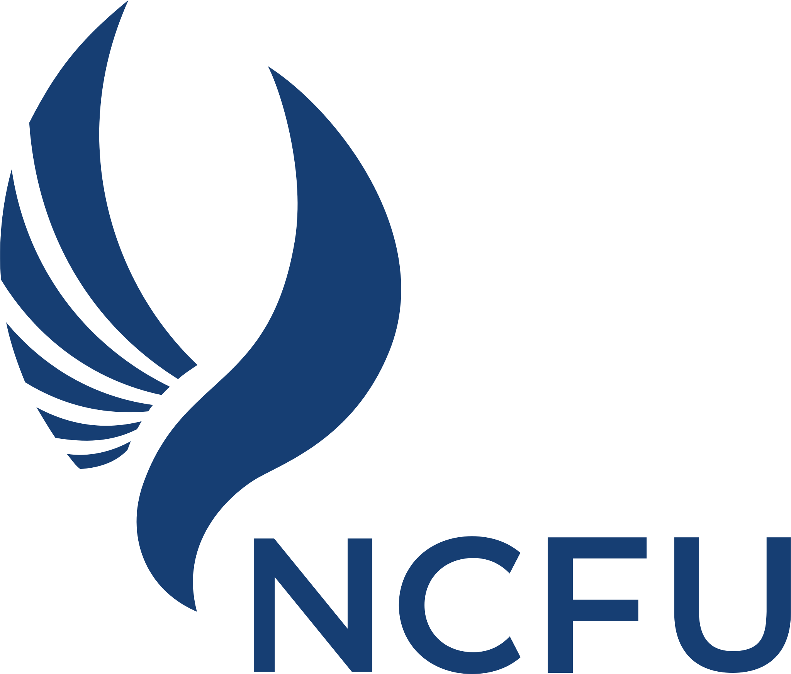

# *Object-Oriented Programming* - Labs in Python

<h1 align="center" style="border-bottom: none">
    <a href="https://ncfu.ru/" target="_blank"></a>
</h1>

This repository contains a set of lab assignments for **Object-Oriented Programming** (*OOP*) using Python.


## 📌 List of Labs

| Lab | Topic | Date     | Done |
|-----|-------|----------|------|
| 1   |       |          | ✅    |
| 2   |       | 02/20/25 | ✅    |
| 3   |       |          | ❌    |
| 4   |       |          | ❌    |
| 5   |       |          | ❌    |


## 📂 Project Structure


## 🚀 How to Run it

1. Just clone the repository!  
   ```bash
   git clone https://github.com/Triddov/pizh-23-11-Akinin
   cd pizh-23-11-Akinin/


## 📦 Requirements

- [x] Python 3.10+    
- [x] No additional dependencies required!


## ☁️ Tasks on Cloud

https://disk.yandex.ru/d/FEu7q-74Z0GLIw


--- 