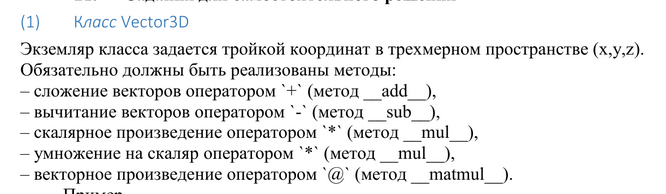

## OOP lab №2

#### Option - 1




## Documentation
Vector3D is a class representing a three-dimensional vector with fundamental operations
such as addition, subtraction, dot product, scalar multiplication, and cross product. 
It also supports calculating the vector's magnitude using the callable method __call__.

```python
class Vector3D:
    def __init__(self, x=0, y=0, z=0):
        # Initializes a Vector3D object with default values of (0,0,0).
        pass

    def display(self):
        # Prints the vector coordinates.
        pass
    
    def read(self):
        # Reads vector coordinates from user input.
        pass
    
    def __add__(self, other):
        # Performs vector addition.
        pass
    
    def __sub__(self, other):
        # Performs vector subtraction.
        pass
    
    def __mul__(self, other):
        # Calculates dot product (if multiplying by another Vector3D) or scalar multiplication (if multiplying by a number).
        pass
    
    def __matmul__(self, other):
        # Computes the cross product of two vectors.
        pass
    
    def __call__(self):
        # Returns the magnitude (length) of the vector.
        pass
    
    def __repr__(self):
        # Returns a string representation of the vector.
        pass

```
